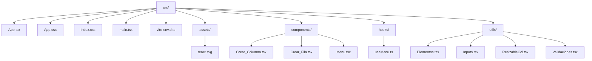

# Generador de Silabos

## Descripción

Aplicación React + TypeScript + Vite para construir formularios dinámicos y personalizables, permitiendo agregar filas y columnas, elegir tipos de campos, personalizar colores, bordes y más.

## Estructura del Proyecto



## Instalación

```sh
npm install
```

## Scripts

- `npm run dev` — Inicia el servidor de desarrollo.
- `npm run build` — Compila el proyecto para producción.
- `npm run preview` — Previsualiza el build de producción.
- `npm run lint` — Ejecuta ESLint.

## Características

- Constructor visual de formularios con filas y columnas.
- Personalización de color de texto, fondo y bordes.
- Soporte para varios tipos de campos: texto, input, select, checkbox, radio, imagen.
- Redimensionamiento de columnas.
- Guardar y cargar configuraciones en JSON.
- Drag & drop para reordenar filas.

## Componentes principales

- **Menu**: Panel principal, lógica de filas/columnas y personalización.
- **Crear_Fila**: Renderiza una fila con columnas.
- **Crear_Columna**: Renderiza el tipo de campo de cada columna.
- **Elementos**: Componentes para cada tipo de campo.
- **ResizableCol**: Permite redimensionar columnas.
- **Inputs**: Inputs personalizados y validaciones.
- **Validaciones**: Funciones de validación.
- **useMenu**: Hook principal para la lógica de estado.

## Personalización

- Cambia colores y bordes desde el panel de personalización.
- Agrega nuevos tipos de campo editando `Elementos.tsx`.

## Cómo probar y generar la aplicación

### 1. Ejecutar en Electron (modo desarrollo)

Puedes iniciar la aplicación en modo desarrollo usando Electron con el siguiente comando:

```powershell
npm run electron
```

Esto abrirá la app en una ventana de Electron.

### 2. Ejecutar en modo preview (Vite)

Para ver la aplicación en modo preview (servidor local de Vite):

```powershell
npm run preview
```

Esto iniciará un servidor local y mostrará la app en el navegador.

### 3. Generar el programa de escritorio (build)

Para crear el instalador y los archivos ejecutables de la app de escritorio, ejecuta:

```powershell
npm run dist
```

> **Importante:** Este comando debe ejecutarse desde el panel de terminal con permisos de administrador para que la generación y escritura de archivos en la carpeta `release/` se realice correctamente.

El instalador y los archivos generados estarán en la carpeta `release/`.
